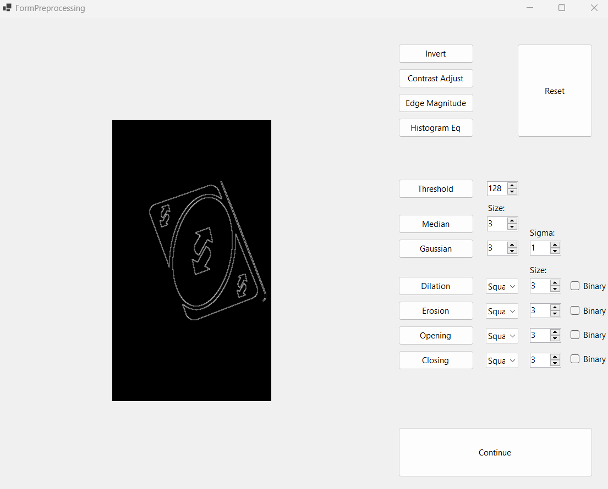

## INFOIBV-Assignment-1

An image processing project for *INFOIBV* by Jandre and Ruben

# Overview
This repository contains a comprehensive project focused on applying various image processing techniques, culminating in the development of an object detection program. Our journey through this project explores the fundamental principles of image manipulation and the integration of these techniques to recognize objects within a given environment.

# Techniques Employed
Throughout the project, we've harnessed several classical image processing methods to enhance, analyze, and transform images to a suitable form for object detection. Some of the key techniques used include:

- Median Blur: Reducing noise from images while preserving edges.
- Gaussian Blur: Applying a Gaussian filter to smoothen images and reduce detail and noise.
- Edge Magnitude: Detecting the edges in images to highlight structural information.
- Dilation: Enhancing prominent features in the image by expanding shapes.
- Erosion: Refining the image by eroding away boundaries of regions of foreground pixels.
- Opening: A morphological process involving an erosion followed by a dilation, used to remove small objects or noise from the foreground of an image while preserving the shape and size of larger objects in the image.
- Closing: The inverse of opening, this process consists of a dilation followed by an erosion. It is effective in closing small holes or gaps in the foreground of an image and can also help in connecting nearby objects.
- SIFT (Scale-Invariant Feature Transform): Utilized for object detection by identifying and using features of objects for matching.
These techniques were implemented step by step, each with the aim to prepare the images for the ultimate task—object detection.

# Object Detection Program
The pinnacle of our project was the creation of an object detection program. This application integrates the aforementioned image processing techniques to preprocess images and then uses SIFT to accurately detect and identify objects.

# User Interface
Our program boasts an intuitive user interface that allows for easy manipulation and application of different preprocessing techniques. Users can load images, select processing methods, and visualize the effects in real-time.

# Object Detection Workflow
The object detection workflow consists of loading a target and a reference image, applying preprocessing techniques, and then employing SIFT to detect the object.

